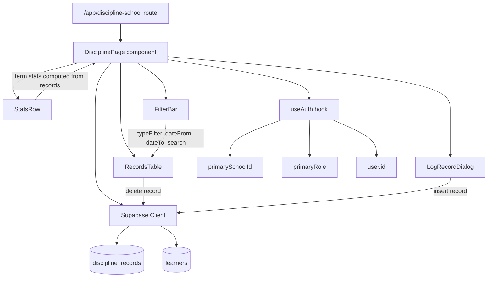
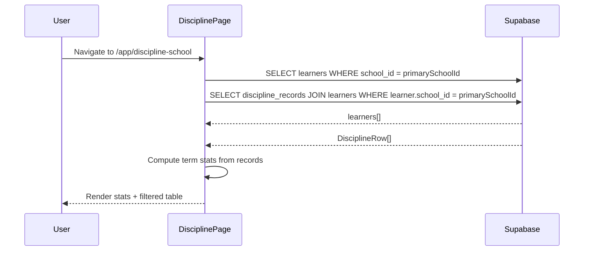
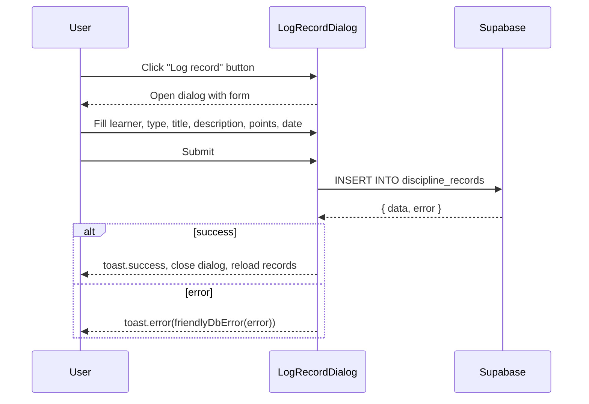
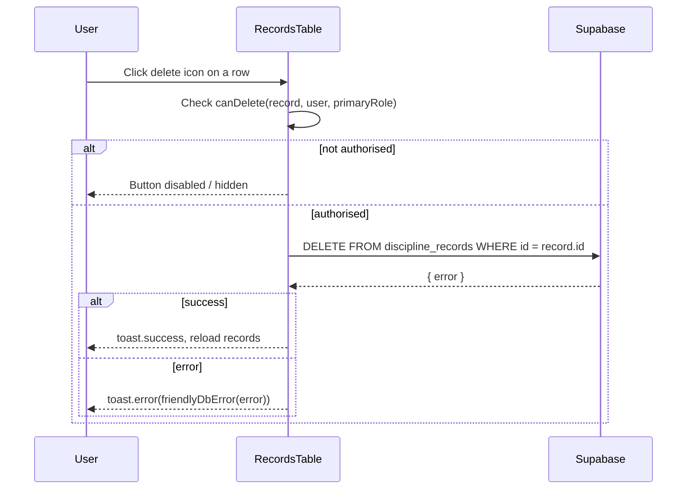

# Design Document: Teacher Discipline Page

## Overview

The Teacher Discipline Page replaces the existing stub at `/app/discipline-school` with a fully functional discipline management interface for school-side users (teachers, principals, school_admin). It allows staff to view all discipline records for learners at their school, log new records, and delete records according to their role permissions.

The page follows the established full-page pattern used by `app.marks-capture.tsx`: a `PageHeader` with an action button, filter controls, a data table rendered inside a `Card`, and a `Dialog` for data entry. All data is fetched from and written to the `discipline_records` Supabase table, scoped to the authenticated user's `primarySchoolId`.

Summary stat cards at the top of the page give staff a quick term-level overview of merits, warnings, and serious incidents (detentions + suspensions) before they interact with the full record list.

---

## Architecture



---

## Sequence Diagrams

### Page Load



### Log New Record



### Delete Record



---

## Components and Interfaces

### DisciplinePage

**Purpose**: Root component for the route. Owns all state, data fetching, and orchestrates child components.

**Interface**:
```typescript
// No props — reads everything from useAuth() and Supabase
function DisciplinePage(): JSX.Element
```

**Responsibilities**:
- Fetch learners and discipline records on mount (and after mutations)
- Derive term stats from the loaded records
- Pass filtered records down to `RecordsTable`
- Gate access: redirect or show error card if `primarySchoolId` is null

---

### StatsRow

**Purpose**: Displays four summary stat cards for the current term: Merits, Warnings, Detentions/Suspensions, and Incidents.

**Interface**:
```typescript
interface StatsRowProps {
  records: DisciplineRow[]
  currentTerm: number
  currentYear: number
}

function StatsRow(props: StatsRowProps): JSX.Element
```

**Responsibilities**:
- Filter records to the current term/year window
- Count by `type` and render coloured stat cards
- Purely presentational — no side effects

---

### FilterBar

**Purpose**: Renders the search input and filter selects (type, date-from, date-to).

**Interface**:
```typescript
interface FilterBarProps {
  search: string
  typeFilter: DisciplineType | ""
  dateFrom: string
  dateTo: string
  onSearchChange: (v: string) => void
  onTypeChange: (v: DisciplineType | "") => void
  onDateFromChange: (v: string) => void
  onDateToChange: (v: string) => void
}

function FilterBar(props: FilterBarProps): JSX.Element
```

**Responsibilities**:
- Render controlled inputs; emit change events upward
- No internal state

---

### RecordsTable

**Purpose**: Renders the discipline records in a table inside a `Card`. Shows an empty state when no records match.

**Interface**:
```typescript
interface RecordsTableProps {
  records: DisciplineRow[]
  loading: boolean
  deleting: string | null
  canDelete: (record: DisciplineRow) => boolean
  onDelete: (record: DisciplineRow) => void
}

function RecordsTable(props: RecordsTableProps): JSX.Element
```

**Responsibilities**:
- Render table rows with type badge, learner name, title, date, points
- Show delete button only when `canDelete(record)` returns true
- Show spinner on the row being deleted

---

### LogRecordDialog

**Purpose**: Modal dialog for logging a new discipline record.

**Interface**:
```typescript
interface LogRecordDialogProps {
  open: boolean
  learners: Learner[]
  onOpenChange: (open: boolean) => void
  onSaved: () => void
}

function LogRecordDialog(props: LogRecordDialogProps): JSX.Element
```

**Responsibilities**:
- Manage form state internally (learner, type, title, description, points, date)
- Validate required fields before submit
- Call Supabase insert; call `onSaved()` on success
- Reset form on close

---

## Data Models

### DisciplineRow (query result shape)

```typescript
type DisciplineType = "merit" | "warning" | "detention" | "suspension" | "incident"

interface DisciplineRow {
  id: string
  date: string                  // ISO date string "YYYY-MM-DD"
  title: string
  description: string | null
  type: DisciplineType
  points: number | null
  recorded_at: string
  recorded_by: string | null
  learner_id: string
  learners: {
    first_name: string
    last_name: string
    grade_id: number
  } | null
}
```

**Validation Rules**:
- `type` must be one of the five enum values
- `title` is required, max 200 characters
- `description` is optional, max 1000 characters
- `points` is optional; if provided must be an integer ≥ 0
- `date` defaults to today; must not be in the future

### Learner (for select dropdown)

```typescript
interface Learner {
  id: string
  first_name: string
  last_name: string
  grade_id: number
  learner_number: string | null
}
```

### LogRecordFormState

```typescript
interface LogRecordFormState {
  learnerId: string
  type: DisciplineType | ""
  title: string
  description: string
  points: string          // string for controlled input, parsed to number on submit
  date: string            // "YYYY-MM-DD"
}
```

---

## Key Functions with Formal Specifications

### filterRecords()

```typescript
function filterRecords(
  records: DisciplineRow[],
  search: string,
  typeFilter: DisciplineType | "",
  dateFrom: string,
  dateTo: string
): DisciplineRow[]
```

**Preconditions:**
- `records` is a non-null array (may be empty)
- `search` is a trimmed string (may be empty)
- `dateFrom` and `dateTo` are either empty strings or valid ISO date strings

**Postconditions:**
- Returns a subset of `records` (never adds new elements)
- If all filter params are empty/falsy, returns all records unchanged
- A record passes the search filter iff `"${first_name} ${last_name}".toLowerCase()` includes `search.toLowerCase()`
- A record passes the type filter iff `typeFilter === ""` or `record.type === typeFilter`
- A record passes the date filter iff `record.date >= dateFrom` (when dateFrom set) and `record.date <= dateTo` (when dateTo set)

**Loop Invariants:**
- All records in the accumulator at any point satisfy all filter conditions checked so far

---

### computeTermStats()

```typescript
interface TermStats {
  merits: number
  warnings: number
  seriousCount: number   // detention + suspension combined
  incidents: number
}

function computeTermStats(
  records: DisciplineRow[],
  termStart: string,
  termEnd: string
): TermStats
```

**Preconditions:**
- `records` is a non-null array
- `termStart` and `termEnd` are valid ISO date strings with `termStart <= termEnd`

**Postconditions:**
- Returns counts of records whose `date` falls within `[termStart, termEnd]` inclusive
- `seriousCount` = count of records with `type === "detention"` + count with `type === "suspension"`
- All four counts are non-negative integers

---

### canDelete()

```typescript
function canDelete(
  record: DisciplineRow,
  userId: string,
  primaryRole: UserRole
): boolean
```

**Preconditions:**
- `record` is a valid `DisciplineRow`
- `userId` is the authenticated user's UUID
- `primaryRole` is a valid `UserRole`

**Postconditions:**
- Returns `true` iff `record.recorded_by === userId` OR `primaryRole` is `"principal"` or `"school_admin"`
- Returns `false` for teachers who did not create the record
- No side effects

---

### getTermWindow()

```typescript
function getTermWindow(year: number): { termStart: string; termEnd: string; term: number }
```

**Preconditions:**
- `year` is a valid calendar year integer

**Postconditions:**
- Returns the start and end ISO date strings for the current South African school term based on `new Date().getMonth()`
- Term 1: Jan–Mar, Term 2: Apr–Jun, Term 3: Jul–Sep, Term 4: Oct–Dec
- `termStart <= termEnd`

---

## Algorithmic Pseudocode

### Main Data Load Algorithm

```typescript
async function loadData(primarySchoolId: string): Promise<void> {
  // PRECONDITION: primarySchoolId is non-null and non-empty
  setLoading(true)

  const [learnersResult, recordsResult] = await Promise.all([
    supabase
      .from("learners")
      .select("id, first_name, last_name, grade_id, learner_number")
      .eq("school_id", primarySchoolId)
      .order("last_name"),

    supabase
      .from("discipline_records")
      .select("id, date, title, description, type, points, recorded_at, recorded_by, learner_id, learners(first_name, last_name, grade_id)")
      .in("learner_id",
        // sub-select: all learner IDs at this school
        supabase.from("learners").select("id").eq("school_id", primarySchoolId)
      )
      .order("date", { ascending: false })
  ])

  setLearners(learnersResult.data ?? [])
  setRecords(recordsResult.data ?? [])
  setLoading(false)

  // POSTCONDITION: learners and records state reflect current DB data for this school
}
```

**Note on the records query**: Supabase does not support a direct `.in()` with a subquery in the JS client. The implementation fetches learner IDs first, then uses `.in("learner_id", ids)`. If the school has more than 1000 learners, pagination or a Postgres function should be used.

### Log Record Submit Algorithm

```typescript
async function handleLogRecord(form: LogRecordFormState, userId: string): Promise<void> {
  // PRECONDITION: form.learnerId !== "" AND form.type !== "" AND form.title.trim() !== ""
  
  const points = form.points !== "" ? parseInt(form.points, 10) : null
  
  // ASSERT: points === null OR (Number.isInteger(points) AND points >= 0)
  
  const { error } = await supabase
    .from("discipline_records")
    .insert({
      learner_id:   form.learnerId,
      type:         form.type as DisciplineType,
      title:        form.title.trim(),
      description:  form.description.trim() || null,
      points:       points,
      date:         form.date,
      recorded_by:  userId,
    })

  IF error THEN
    toast.error(friendlyDbError(error))
    RETURN
  END IF

  toast.success("Record logged successfully")
  onSaved()   // triggers parent reload
  resetForm()
  onOpenChange(false)

  // POSTCONDITION: new record exists in discipline_records; UI reflects updated list
}
```

### Delete Record Algorithm

```typescript
async function handleDelete(record: DisciplineRow): Promise<void> {
  // PRECONDITION: canDelete(record, userId, primaryRole) === true
  
  setDeleting(record.id)

  const { error } = await supabase
    .from("discipline_records")
    .delete()
    .eq("id", record.id)

  setDeleting(null)

  IF error THEN
    toast.error(friendlyDbError(error))
    RETURN
  END IF

  toast.success("Record deleted")
  loadData(primarySchoolId)

  // POSTCONDITION: record no longer exists in discipline_records; UI reflects updated list
}
```

---

## Example Usage

```typescript
// Route file: src/routes/app.discipline-school.tsx
import { createFileRoute } from "@tanstack/react-router"
import { DisciplinePage } from "@/components/funda/dashboards/DisciplinePage"

export const Route = createFileRoute("/app/discipline-school")({
  component: DisciplinePage,
})

// ── Inside DisciplinePage ──────────────────────────────────────────────────

const { primaryRole, primarySchoolId, user } = useAuth()

// Determine delete permission for a given record
const canDelete = (record: DisciplineRow): boolean =>
  record.recorded_by === user?.id ||
  primaryRole === "principal" ||
  primaryRole === "school_admin"

// Apply all active filters to the loaded records
const filtered = filterRecords(records, search, typeFilter, dateFrom, dateTo)

// Compute term stats for the summary cards
const { termStart, termEnd, term } = getTermWindow(new Date().getFullYear())
const stats = computeTermStats(records, termStart, termEnd)

// ── Stat card example ──────────────────────────────────────────────────────
<StatCard
  label="Merits"
  value={stats.merits}
  icon={<Star className="size-4 text-green-600" />}
  colorClass="text-green-600 bg-green-500/10"
/>

// ── Type badge colour mapping ──────────────────────────────────────────────
const TYPE_COLORS: Record<DisciplineType, string> = {
  merit:      "text-green-600 bg-green-500/10",
  warning:    "text-orange-500 bg-orange-500/10",
  detention:  "text-red-500 bg-red-500/10",
  suspension: "text-red-700 bg-red-700/10",
  incident:   "text-purple-600 bg-purple-500/10",
}
```

---

## Correctness Properties

- For all records `r` returned by `filterRecords`, `r` must be an element of the original `records` array (no fabrication).
- For all `r` in `filterRecords(records, search, ...)` where `search !== ""`, `"${r.learners.first_name} ${r.learners.last_name}".toLowerCase()` must include `search.toLowerCase()`.
- `canDelete(record, userId, role)` returns `true` if and only if `record.recorded_by === userId` OR `role === "principal"` OR `role === "school_admin"`.
- `computeTermStats(records, start, end).merits` equals the count of records where `type === "merit"` AND `date >= start` AND `date <= end`.
- After a successful insert, `loadData()` returns a records array whose length is exactly one greater than before the insert (assuming no concurrent mutations).
- After a successful delete, `loadData()` returns a records array that does not contain the deleted record's `id`.

---

## Error Handling

### No School Assigned

**Condition**: `primarySchoolId` is null after auth loads  
**Response**: Render an informational `Card` with a message ("No school assigned to your account.") — same pattern as `marks-capture.tsx`  
**Recovery**: User must contact admin; no retry needed

### Supabase Query Error

**Condition**: `discipline_records` or `learners` fetch returns an error  
**Response**: `toast.error(friendlyDbError(error))`, set `loading = false`, show empty state  
**Recovery**: User can refresh the page

### Insert Validation Error

**Condition**: Required fields missing (learner, type, title) before submit  
**Response**: Client-side guard — show inline error or `toast.error`; do not call Supabase  
**Recovery**: User corrects the form

### Insert DB Error

**Condition**: Supabase returns an error on insert (e.g. FK violation, RLS denial)  
**Response**: `toast.error(friendlyDbError(error))`; dialog stays open so user can retry  
**Recovery**: User can retry or cancel

### Delete Error

**Condition**: Supabase returns an error on delete  
**Response**: `toast.error(friendlyDbError(error))`; `deleting` state cleared  
**Recovery**: User can retry

---

## Testing Strategy

### Unit Testing Approach

Test pure utility functions in isolation:
- `filterRecords`: verify each filter dimension independently and in combination
- `computeTermStats`: verify counts for each type, boundary dates, empty input
- `canDelete`: verify all three permission paths (own record, principal, school_admin, other teacher)
- `getTermWindow`: verify correct term boundaries for each month

### Property-Based Testing Approach

**Property Test Library**: `fast-check`

Key properties to test:
- `filterRecords` never returns records not in the input array (subset property)
- `filterRecords` with no filters returns the full input array (identity property)
- `computeTermStats` counts are always non-negative and sum ≤ total records in window
- `canDelete` is deterministic: same inputs always produce same output

### Integration Testing Approach

- Mock Supabase client to test `loadData`, `handleLogRecord`, and `handleDelete` flows
- Verify that after a successful insert, `loadData` is called exactly once
- Verify that the dialog closes and form resets after a successful save
- Verify that a failed insert keeps the dialog open

---

## Performance Considerations

- Learners and records are fetched in parallel with `Promise.all` to minimise load time.
- Filtering is done client-side on the already-loaded dataset — acceptable for school sizes (typically < 2000 learners, < 10 000 records per year).
- If a school has > 1000 learners, the `learner_id IN (...)` query must be chunked or replaced with a Postgres RPC to avoid URL length limits in the Supabase REST client.
- The records query is ordered by `date DESC` so the most recent records appear first without client-side sorting.

---

## Security Considerations

- All queries are scoped to `primarySchoolId` from the auth context — a user cannot access records from another school.
- Delete permission is enforced both client-side (button visibility) and should be enforced server-side via Supabase RLS policies: teachers may only delete rows where `recorded_by = auth.uid()`, while principals and school_admin may delete any row in their school.
- `recorded_by` is set to `user.id` on insert — the client never allows the user to spoof another user's ID.
- `points` input is parsed with `parseInt` and validated as a non-negative integer before insert.

---

## Dependencies

| Dependency | Already in project | Purpose |
|---|---|---|
| `@tanstack/react-router` | ✅ | Route definition |
| `@supabase/supabase-js` | ✅ | Data access |
| `shadcn/ui` (Card, Dialog, Select, Input, Textarea, Badge, Button, Label) | ✅ | UI components |
| `sonner` (toast) | ✅ | User feedback |
| `lucide-react` | ✅ | Icons |
| `@/lib/auth-context` (useAuth) | ✅ | Auth state |
| `@/lib/db-errors` (friendlyDbError) | ✅ | Error formatting |
| `@/components/funda/dashboards/PageHeader` | ✅ | Page header pattern |
